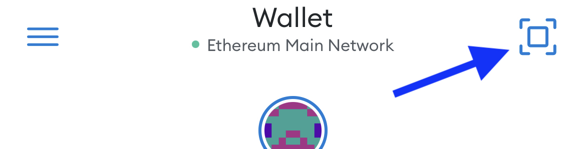
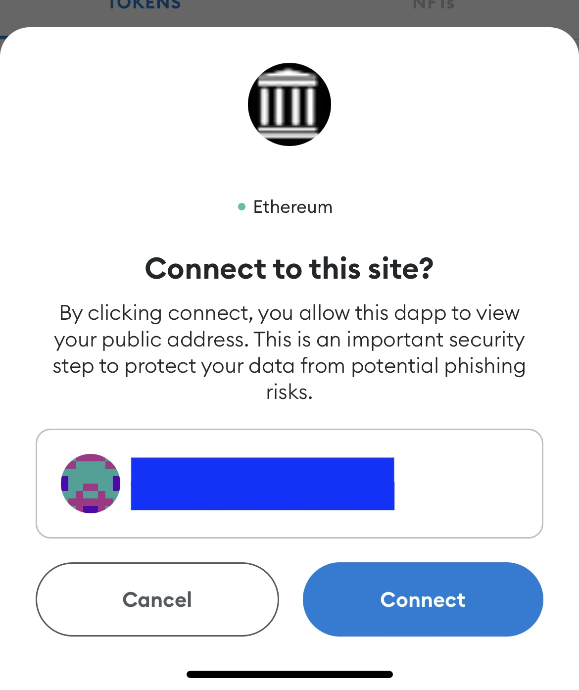
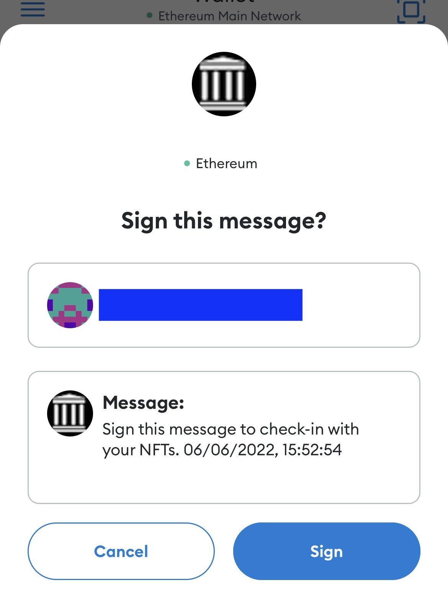

# 🎉 ✅ NFT CHECK-IN

A web app to easily check if a person owns an NFT from a set of collections.
It can be used for the check-in of guests at token gated events, parties, etc.

Guests must have a wallet compatible with [WalletConnect](https://walletconnect.com) (e.g., Metamask, Trust).

## Usage

The app is live at [https://nftcheck.in](https://nftcheck.in)

-   **Host**
    -   Choose the allowed collections
    -   Click SCAN and a QR Code will appear
    -   Let your guests scan the QR code with their devices and verify their ownership
    -   Click restart for checking the next guest

<br/>

-   **Guest (Metamask)**
    -   Open Metamask on a smartphone
    -   Click on the _scan_ icon on the top right corner
        <br/>
    -   Scan the QR code and confirm the connection
        <br/>
    -   Confirm the check-in by signing a message (off-chain, no fees)
        <br/>

## Install and run

Install dependencies:

```
yarn
```

Run:

```
yarn dev
```

Open [localhost:3000](localhost:3000) in your browser and enjoy!

## How to contribute

We welcome PRs related to UI/UX improvements and new features.
Fork the project and have fun!

<br/>
<br/>

Made with ❤️&nbsp; by [Rentable](https://rentable.world)
